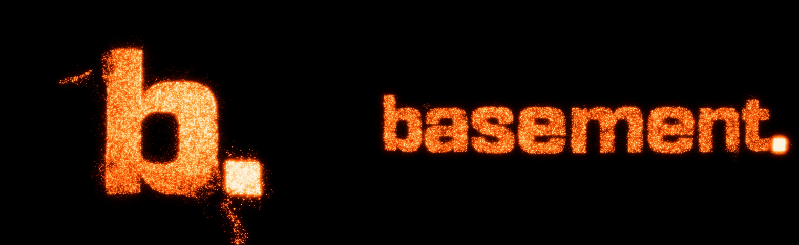

# glow



About 24,000 embers form the basement.studio `b.` isotype, carved on a sphere. Click and they flow into the `basement.` wordmark. The dot stays whole, travels across the screen and is always the hottest thing in the scene.

**Live demo:** https://basement-glow.vercel.app

An unofficial tribute to [basement.studio](https://basement.studio).

## Interaction

- Click or tap the canvas, press the button, or hit <kbd>Space</kbd> / <kbd>Enter</kbd> to morph between `b.` and `basement.`. Clicking mid-morph reverses it.
- Move the pointer to tilt the sculpture and stir the embers. On touch screens, drag to tilt.
- `prefers-reduced-motion` is respected: no turbulence, flares or tilt, an instant intro, and the morph becomes a short cross-fade.

## How it works

1. **Shapes.** The logo's SVG paths are rasterized into masks with `Path2D`. A chamfer distance transform measures the distance to the edge, and points are sampled by kind: surface (65 %), volume (20 %), rim (3 %) and halo (12 %). The isotype is embedded on a sphere by casting rays from the camera, so it looks flat from the front and gains real depth when it tilts. The wordmark sits on a gently curved panel.
2. **Simulation (CPU).** Particles live in `Float32Array`s, one per property. A stratified shuffle keeps every prefix representative, so the active particle count can adapt to the frame rate without breaking anything. Both shapes are paired column by column, so neighbors stay neighbors during the morph. Every frame, springs pull each particle toward a target that combines a curl-noise flow field (breathing), flares that erupt from the edges, pointer swirl and tilt, and the morph trajectory. The dot rides a quadratic Bézier and leaves a trail.
3. **Render (WebGL2).** Instanced quads add *heat* rather than color into a floating-point buffer (RGBA8 fallback). A four-level bloom blurs it, and a composite pass tone-maps the heat through an orange color ramp (`#000000` → `#3C0800` → `#FF4D00` → `#FFB347` → `#FFF4E0`) with a touch of grain.

## Stack

Vite, strict TypeScript, raw WebGL2 and Vitest. No runtime dependencies.

## Getting started

Requires Node 24.

```bash
npm install
npm run dev         # http://localhost:5173
npm test            # unit tests for the pure modules
npm run typecheck
npm run build       # production build in dist/
```

## Project structure

```
src/
  main.ts       bootstrap, input, UI and render loop
  config.ts     every tunable parameter
  view.ts       layout, tilt rotation and projection
  perf.ts       FPS counter and adaptive particle count
  shapes/       SVG paths → mask → distance field → sampled points → 3D embedding
  sim/          state machine, pairing, morph, flow field, tilt, flares, per-frame step
  render/       WebGL2 heat pass, bloom and color-ramp composite
test/           Vitest suites
```

Everything under `shapes/` (except `raster.ts`) and `sim/`, plus `view.ts`, `perf.ts` and `render/ramp.ts`, is pure: no DOM or WebGL, tested in Node.

## Tuning

All parameters live in [`src/config.ts`](src/config.ts): particle counts, timings, spring constants, breathing and flare strength, heat, bloom and exposure.

## License

- The basement.studio logo and wordmark are trademarks of [basement.studio](https://basement.studio). This project is an unofficial, non-commercial tribute, and the logo is **not** covered by this project's license.
- The code is released under the [MIT License](LICENSE).
